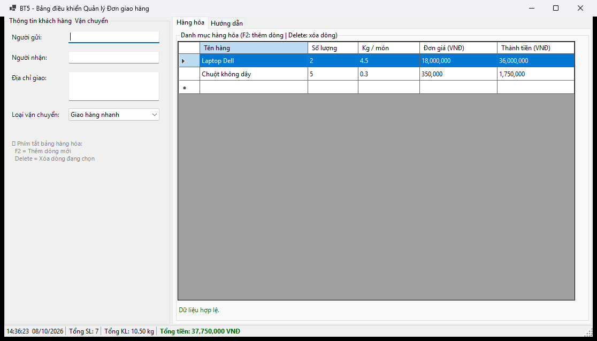
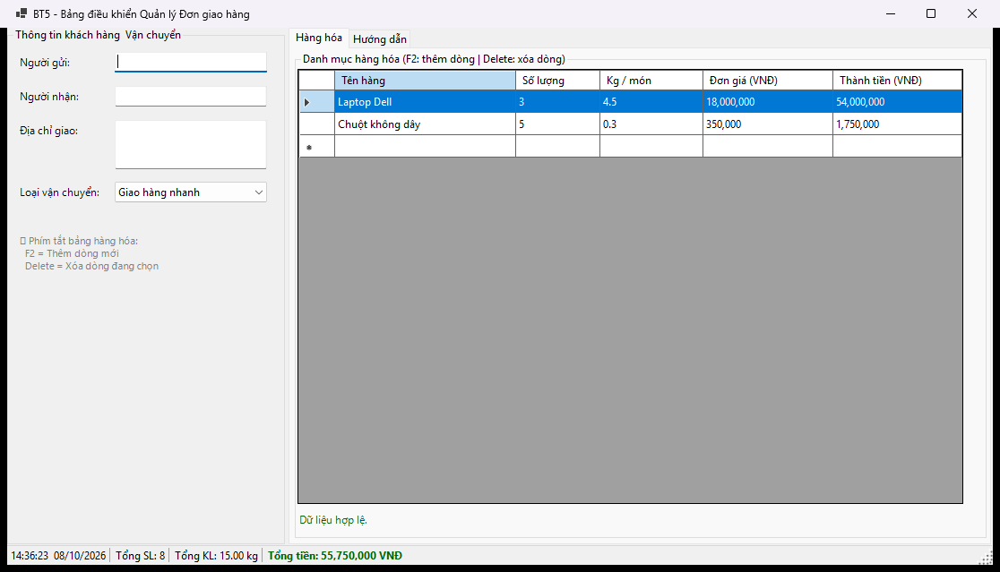
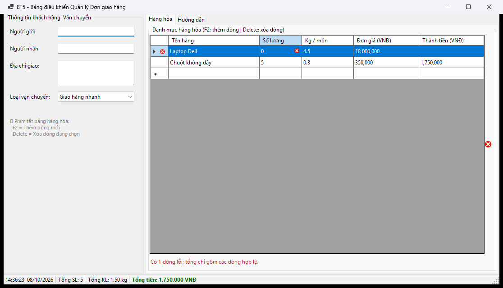

# BÁO CÁO BÀI TẬP / ĐỒ ÁN

## THÔNG TIN SINH VIÊN

- **Họ và tên:** Phạm Tuấn Thành
- **Mã số sinh viên:** 24810320264
- **Lớp:** D19QTANM1
- **Tên môn học:** Lập trình C# / Windows Forms
- **Tên bài tập:** Bài 5 — Bảng điều khiển Quản lý Đơn giao hàng

---

## KẾT QUẢ THỰC HÀNH

Ảnh chụp từ ứng dụng chạy thực tế trên Windows trong lần kiểm thử ngày **08/10/2026**.

### 1. Ảnh màn hình Giao diện chính



Dashboard có thông tin khách hàng, các tab hàng hóa/hướng dẫn và thanh tổng hợp; dữ liệu mẫu gồm 7 món, 10,50 kg, 37.750.000 VNĐ.

### 2. Ảnh màn hình Chức năng thực thi / Kết quả



Đổi số lượng Laptop từ 2 thành 3: tổng tăng thành 8 món, 15,00 kg và 55.750.000 VNĐ. Trọng lượng được tính bằng kg/món × số lượng.

### 3. Ảnh màn hình Kiểm tra lỗi (Validation)



Nhập số lượng Laptop bằng 0: ô và dòng hiển thị lỗi, ErrorProvider xuất hiện; tổng chỉ tính dòng Chuột hợp lệ (5 món, 1,50 kg, 1.750.000 VNĐ).

Ảnh được chụp khi kiểm thử với thiết lập vùng en-US, nên dấu phân cách số trong ảnh theo thiết lập đó. Giá trị tiền và trọng lượng không thay đổi.

---

## MÔ TẢ BÀI TẬP

Dashboard nhập thông tin khách hàng và chỉnh trực tiếp các dòng hàng hóa, theo dõi tổng đơn theo thời gian thực.

- SplitContainer chia khung khách hàng và bảng hàng; TabControl có tab Hàng hóa và Hướng dẫn.
- DataGridView có tên hàng, số lượng, kg/món, đơn giá và thành tiền tự tính, không cho sửa cột thành tiền.
- ErrorProvider hiện cạnh ô đang sửa; Cell.ErrorText / Row.ErrorText giữ lỗi từng ô và từng dòng.
- Số lượng là số nguyên > 0; trọng lượng > 0; đơn giá >= 0; nhập chữ hoặc để trống ô số đều có lỗi.
- Tính lại tổng từ số gốc sau thêm, sửa, xóa; số lượng × đơn giá ra thành tiền; số lượng × kg/món ra trọng lượng dòng.
- StatusStrip có giờ hệ thống bằng Timer, tổng số lượng, tổng trọng lượng và tổng tiền.
- F2 thêm dòng và mở sửa tên; Delete xóa dòng khi bảng được focus và không đang sửa ô.
- Delete trong ô khách hàng vẫn xóa ký tự; Timer và ErrorProvider được Dispose cùng form.

## ĐỐI CHIẾU YÊU CẦU

| Mã | Nội dung đã triển khai | File chính |
|---|---|---|
| R5-1 | SplitContainer chia khung khách hàng và bảng hàng; TabControl có tab Hàng hóa và Hướng dẫn. | `MainForm.cs` / `MainForm.Designer.cs` |
| R5-2 | DataGridView có tên hàng, số lượng, kg/món, đơn giá và thành tiền tự tính, không cho sửa cột thành tiền. | `MainForm.cs` / `MainForm.Designer.cs` |
| R5-3 | ErrorProvider hiện cạnh ô đang sửa; Cell.ErrorText / Row.ErrorText giữ lỗi từng ô và từng dòng. | `MainForm.cs` / `MainForm.Designer.cs` |
| R5-4 | Số lượng là số nguyên > 0; trọng lượng > 0; đơn giá >= 0; nhập chữ hoặc để trống ô số đều có lỗi. | `MainForm.cs` / `MainForm.Designer.cs` |
| R5-5 | Tính lại tổng từ số gốc sau thêm, sửa, xóa; số lượng × đơn giá ra thành tiền; số lượng × kg/món ra trọng lượng dòng. | `MainForm.cs` / `MainForm.Designer.cs` |
| R5-6 | StatusStrip có giờ hệ thống bằng Timer, tổng số lượng, tổng trọng lượng và tổng tiền. | `MainForm.cs` / `MainForm.Designer.cs` |
| R5-7 | F2 thêm dòng và mở sửa tên; Delete xóa dòng khi bảng được focus và không đang sửa ô. | `MainForm.cs` / `MainForm.Designer.cs` |
| R5-8 | Delete trong ô khách hàng vẫn xóa ký tự; Timer và ErrorProvider được Dispose cùng form. | `MainForm.cs` / `MainForm.Designer.cs` |

## CÁCH MỞ VÀ CHẠY

Yêu cầu Windows, .NET 10 SDK và Visual Studio 2026 có workload **.NET desktop development**.

1. Mở `DeliveryDashboard.sln` bằng Visual Studio 2026.
2. Nhấn **F5** để chạy ứng dụng.
3. Để thiết kế UI: chọn `MainForm.cs` trong Solution Explorer → **Shift+F7** hoặc **View Designer**.
4. Trong Designer, **Ctrl+Alt+X** mở Toolbox. **F7** trở về code.

Chạy bằng terminal tại thư mục repo:

```powershell
dotnet restore DeliveryDashboard.sln
dotnet build DeliveryDashboard.sln
dotnet run --project src/DeliveryDashboard/DeliveryDashboard.csproj
```

UI tĩnh nằm trong `MainForm.Designer.cs`; xử lý sự kiện nằm trong `MainForm.cs`; tài nguyên form nằm trong `MainForm.resx`.

## HƯỚNG DẪN SỬ DỤNG

1. Điền người gửi, người nhận, địa chỉ và loại vận chuyển ở cột trái.
2. Chỉnh ô số trong tab **Hàng hóa**, nhấn Enter/Tab hoặc rời ô để cập nhật tổng.
3. F2 thêm dòng; kết thúc sửa ô rồi nhấn Delete để xóa dòng đang chọn.
4. Nhập số lượng `0` hoặc trọng lượng âm để xem lỗi. Sửa một dòng khác sẽ không xóa lỗi còn lại.
5. Dữ liệu mẫu có tổng 37.750.000 VNĐ và 10,50 kg. Đổi Laptop từ 2 thành 3 chiếc: 55.750.000 VNĐ và 15,00 kg.

## KIỂM THỬ

Build bản sửa trên Windows: **0 lỗi, 0 cảnh báo**. Đã chạy 20/20 kiểm tra đạt với vi-VN. Chạy thêm 20/20 đạt với en-US.

Xem [bảng kiểm thử](./docs/TESTING.md) và [kết quả chạy](./docs/test-results.json). Kết quả tự động không thay thế việc kiểm tra kéo thả Designer và thao tác GUI ở mọi mức DPI.

## GIẢ ĐỊNH VÀ PHẠM VI

Theo xác nhận của người dùng: cột kg/món là trọng lượng mỗi món; tổng trọng lượng = tổng (số lượng × kg/món). Dòng sai được loại khỏi cả ba tổng và có cảnh báo rõ. Đơn giá cho phép 0; hàng mẫu có giá dương. Dữ liệu lưu trong RAM.

## QUY TRÌNH NỘP VÀ PUSH

Repo đã được khởi tạo trên nhánh `main` và liên kết `origin`. Sau khi thay đổi code, README hoặc screenshot, chạy:

```powershell
git config user.name "Pham Tuan Thanh"
git config user.email "tuanthanhpham206@gmail.com"
git status
git add .
git commit -m "Nop bai tap BT5 - MSSV 24810320264 - Pham Tuan Thanh"
git push -u origin main
```

`.gitignore` bỏ qua `bin/`, `obj/`, `.vs/`, `*.user`, `*.suo`. Đăng nhập bằng Git Credential Manager; không đặt token trong URL remote hoặc mã nguồn.

## CHECKLIST TRƯỚC KHI NỘP

- [x] README có họ tên và MSSV.
- [x] README đã điền lớp D19QTANM1.
- [x] `screenshots/` có đủ 3 ảnh chạy thực tế.
- [x] Ảnh hiển thị trực tiếp trên trang chính GitHub.
- [x] `.gitignore` loại tệp build và cấu hình cá nhân của Visual Studio.
- [x] Repository Public.
- [x] Mã nguồn, README và ảnh đã commit/push lên nhánh `main`.
